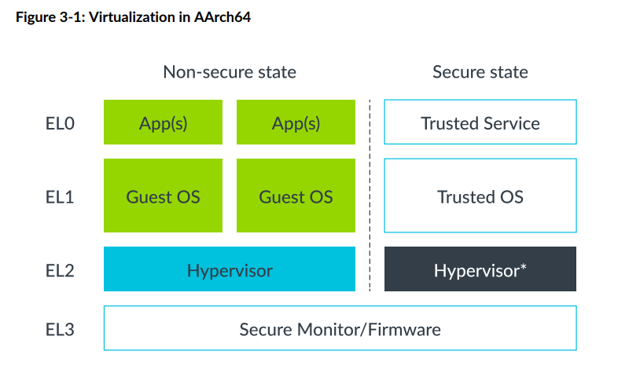

## aarch64 虚拟化

### Stage 2 translation

整个地址的映射分成了两个阶段：

Stage 1: VA(Virutal Address) -> IPA(Intermediate Physical Address)，操作系统控制Stage 1转换; -- GPA
Stage 2: IPA(Intermediate Physical Address) -> PA(Physical Address)，Hypervisor控制Stage 2转换;
Stage 2转换与Stage 1转换机制很类似，不同点在于Stage 2转换时判断内存类型是normal还是device时，是存放进页表信息里了，而不是通过MAIR_ELx寄存器来判断；

每个虚拟机（VM，Virtual Machine）都会分配一个VMID，用于标识TLB entry所属的VM，允许在TLB中同时存在多个不同VM的转换；

操作系统会给应用程序分配一个ASID(Address Space Identifier)，也可以用于标识TLB entry，属于同一个应用程序的TLB entry都有相同的ASID，不同的应用程序可以共享同一块TLB缓存。每个VM都有自己的ASID空间，通常会结合VMID和ASID来同时使用；

Stage 1和Stage 2的转换页表中，都包含了属性的相关设备，比如访问权限，存储类型等，在两级转换的过程中，MMU会整合成一个最终的也有效值，选择限制更严格的属性，如下图：

### linux context in aarch64

